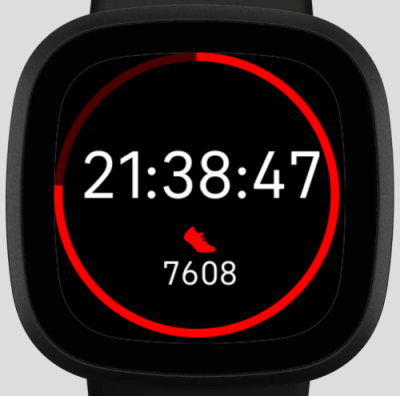

# Demonstration of Fitbit clock face development
This project contains the code to teach bases of Fitbit development.

## Screenshot

## Requirements
Prior to use this code, your computer should have :
- [Node.js](https://nodejs.org)
- [Fitbit Simulator](https://simulator-updates.fitbit.com/download/latest/win)
- Your favorite code editor (for me it is [Visual Studio Code](https://code.visualstudio.com/Download) with the [Fitbit SDK Extenstion](https://marketplace.visualstudio.com/items?itemName=JeremyJeanson.fitbit-sdk-extension))